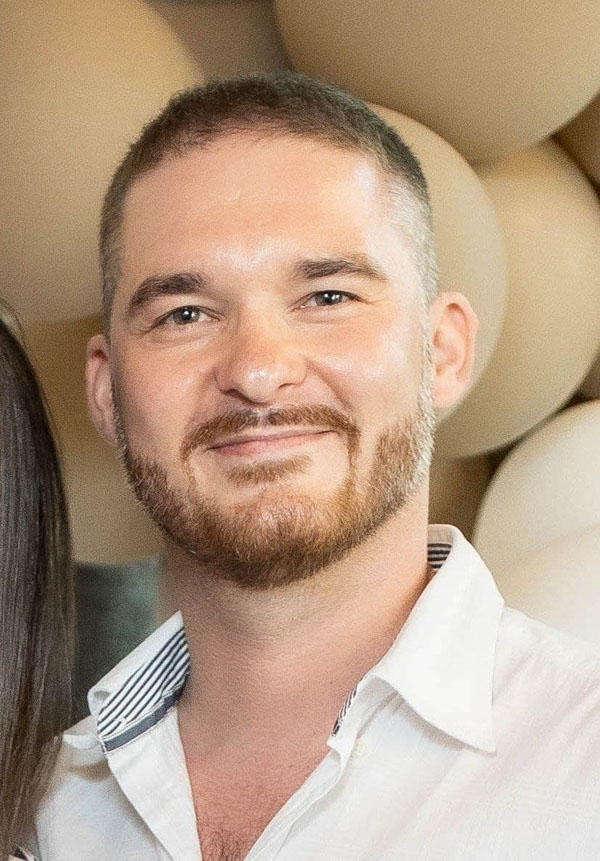

# Dmytro Chushko

## junior fullstack developer

### Summary

I am a Front-end developer looking for a full-time position remotely or in the office. I see my work in the search and implementation of solutions that can simplify the lives and activities of other people. I respect organization, clearly defined tasks and planned activities. I have experience as a Scrum Master and Team Leader. I want to be part of the team, develop myself and help others.

### Tech skills

- HTML5/CSS3/SASS
- Cross-platform/Responsive Layouts
- GIT
- JavaScript
- React
- Redux
- Node.js
- REST API
- TypeScript
- NestJS
- Jira

### Soft skills

- Flexible
- Communicative
- Cooperative
- Imaginative
- Critical thinking skills

### Education

Kyiv Polytechnic Institute. Institute of Telecomunication Systems\
2000 - 2006\
Specialist of Telecomunication Nets and Systems

### Work experience

Trainee Full Stack Developer
ZenBit | 12.2022-01.2023

- developing frontend components and layout
- developing backend logic and database schema
- fixing bugs
- deployment on AWS
- teamwork with PM, daily meetings, sprints, demo, GIT.

Achievement: mastered Nest.js and TypeScript technologies

### Projects

[IceCream](https://dmytro-chushko.github.io/icecream/), [git](https://github.com/dmytro-chushko/icecream) (HTML, SASS, JS, responsive layout)
One-page company site.\
Team project. Role: Scrum Master and Frontend developer.

[Filmoteka](dmytro-chushko.github.io/filmoteka/), [git](https://github.com/dmytro-chushko/filmoteka) (HTML, SASS, JS,
Handlebars, Axios, REST API, Parcel, OOP)
Movie search app\
Team project. Role: Team Lead and Frontend developer.

[Petly](https://project-group-4-petly.netlify.app/petly-project-fe), [git](https://github.com/dmytro-chushko/petly-project-frontend) (HTML, CSS, Styled-Components, React, Redux Toolkit, RTK Query, MongoDB, Express)
Bulletin board app for pets.\
Team project. Role: Fullstack developer.

[Freelance](http://client-zb5-freelance.s3-website.eu-central-1.amazonaws.com/), [git](https://github.com/dmytro-chushko/syntactic-sugar_frontend) (HTML, React,
Styled-Components, TypeScript, Redux Toolkit, Redux
Query, Nest.js, MySQL)
Job search app.\
Internship project. Role: Fullstack developer.

### Languages

Ukrainian - native\
Russian - native\
English - Intermediate

### Aditional Education

IT School GoIT (Kyiv)\
2021-2022 | Full Stack Developer\

[Udemy](https://www.udemy.com/certificate/UC-ae8a2366-8a3b-4f64-b129-13e927f8a21b/)\
2021-2022 | JavaScript + React

### Contact information

+380674097948\
dmytro.chushko@gmail.com\
[GIT](https://github.com/dmytro-chushko)\
[linkedin](https://www.linkedin.com/in/dmytro-chushko/)\
discord - Dmytro Chushko (@dmytro-chushko)\
Kyiv, Ukraine
